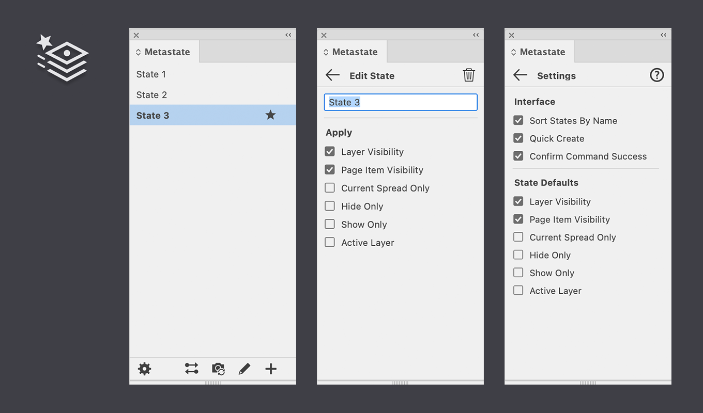

# Rxcle Metastate for InDesign

Metastate is a productivity plugin for Adobe InDesign that enables you to take named snapshots of the visibility and selection states of Layers and Page Items and quickly switch between these states. The states are stored within your documents as non-critical metadata, which means that documents with states can still be opened and edited without having the Metastate plugin installed.

## Operation
Set the visibility and selection of Layers and Page Items to the desired configuration you want to save "snapshots" of in InDesign. Now either create a new State or Update an existing State in the Metastate panel. The visibility and selection and selection state will now be remembered. You can now make any changes and recall the saved state at any time using the Apply command in Metastate. 

You can create any number of states per document and quickly switch between them. Metastate gives several options for specifying which parts of the stored state you want to apply. For example, you might want to only restore the state of Layers but not Page Item. You can configure this (and more) globally or per individual State.

States are stored as part of the document. This means that when you add, update or delete States the document is modified. Make sure that you save your document if you want the changes to be persisted. Any change made with Metastate, including applying a certain state, can be undone and redone via InDesigns built-in Undo/Redo commands.

## Interface

All of Metastate's functionality can be accessed through the Metastate panel, which can be opened via the **Plug-ins** > **Metastate** menu in InDesign. Metastate acts upon, and stores state information in the active document in InDesign. If no document is active then only the global Settings can be changed. Create or open any InDesign document to access all of Metastate's functionality.

The panel has three views:

| View                          | Description |
|-------------------------------|-------------|
| [**Main**](#main)             | Shows a list of defined States and commands on the bottom toolbar.
| [**Edit State**](#edit-state) | Shown when editing (or creating) a single state.
| [**Settings**](#settings)     | Global settings for Metastate.

## Main
The main view shows the list of defined States in the active document. Initially a document will have no states and this list will be empty. Use the **Create** button on the bottom-right of the panel to Create one or more States, which show up as items in the list.

Every item in the list shows the following information of a State:

| Part             |                         | Description |
|------------------|-------------------------|-------------|
| **Name**         |                         | Name of the State, this can be changed in the Edit State view
| **Updated Icon** |  | Indicates that a state was last Updated or Created
| **Applied Icon** |  | Indicates that a state was last Applied
| **Selector**     |   | Click to select (highlight) or deselect a state, without applying it
 
Clicking on a State in the list will Apply it immediately. If you only want to _select_ a State but not apply it, you can either click on the Selector circle at the far-right or hold **Option/Alt** **+ Click** on any part of the State.

Notes:
- The most recent **Applied** State also is indicated with bold text.
- The last **Applied** State is not necessarily the current _"effective"_ state. Meaning, that after applying a State you might have made different Layers etc. visible. Metastate does not track these manual changes until a State is either created or updated.

The bottom toolbar contains the following commands, from left to right:

| Button       |                          | Description |
|--------------|--------------------------|-------------|
| **Settings** |  | Open the global Settings view
| **Toggle**   |    | Quickly switch between the last two applied States. Only shown if there have been at least two different States been recently applied in a document.
| **Update**   |    | Update the selected (highlighted) State with the current visibility state and selection in InDesign. Only shown if there is a State selected.
| **Edit**     |      | Open the Edit State view for the selected State.
| **Create**   |    | Creates a new State using the current effective state in InDesign as its snapshot.

Notes: 
- To **Edit** you can also double click on any State in the list to open its Edit State view.
- The behavior of **Create** depends on a global setting, clicking this button will either create a State immediately (Quick Create) or will first show the Edit State interface for the State to be created.
- No **Delete** button is shown here, you can delete a State by clicking **Edit** first. Alternatively you can **Option/Alt** **+ Click** on the **Edit** button to delete the selected State immediately.

## Edit State
The Edit State view allows you to change the properties of an existing State, or in case of a new State, set the properties before actually creating the new State.

The Edit State interface is shown when:
- Clicking the **Edit** button on the toolbar under the State list
- Double-clicking on a State in the list
- Clicking the Create button
  - when Quick Create is _disabled_: **Click**
  - When Quick Create is _enabled_: **Option/Alt** **+ Click**

The top of this view is a title bar that contains the following buttons, from left to right:

| Button      |                         | Description |
|-------------|-------------------------|-------------|
| **Back**    |     | Apply any changes and go back to the Main view.
| **Restore** |  | Undo changes in the current view. Only shown when there are changes, never shown when creating a new State.
| **Delete**  |   | Delete the State (or not create in case of new).
  
Notes:
- No confirmation is shown for **Delete**, the State is deleted immediately. You can use InDesign's Undo command to bring it back.

The options shown are as follows, from top to bottom:

| Option                   | Description |
|--------------------------|-------------|
| **Name**                 | The name of the state. Any non-empty name is allowed here.
| **Layer Visibility**     | See [Settings](#settings).
| **Page Item Visibility** | See [Settings](#settings).
| **Current Spread Only**  | See [Settings](#settings).
| **Hide Only**            | See [Settings](#settings).
| **Show Only**            | See [Settings](#settings).
| **Active Layer**         | See [Settings](#settings).

Notes:
- All these options are stored (per state) in the active document.
- Pressing the **Enter** key with focus in the **Name** input will apply changes and go back to the Main view
- Pressing the **Esc** key with focus in the **Name** input will discard changes and go back to the Main view.

## Settings
The Settings view allows you to change global settings for Metastate and perform certain actions. The settings in this view are _not_ stored as part of the document but rather on your local system. You can open the Settings view with the **Settings** button (bottom-left) on the Main Metastate panel.

The top of this view is a title bar that contains the following buttons, from left to right:

| Button    |                      | Description |
|-----------|----------------------|-------------|
| **Back**  |  | Apply any changes and go back the Main view.
| **Help**  |  | Opens the help file in your default browser. A permission dialog may appear from your operating system.

The settings and actions shown are as follows, from top to bottom:

| Setting                  | Description |
|--------------------------|-------------|
| **Sort State By Name**   | Enable to sort states in alphabetical order, disable to sort in creation order.
| **Quick Create**         | Enable to create new states immediately, using a default name. Disable to  show the Edit State view first.
| **Layer Visibility**     | Enable to restore the visibility state (shown/hidden) of Layers.
| **Page Item Visibility** | Enable to restore the visibility state (shown/hidden) of Page Items.
| **Current Spread Only**  | Enable to only restore the visibility state of Page Items for the current Spread. Disable to restore for the entire document.
| **Hide Only**            | Enable to only _hide_ additional Layers and Page Items when applying; Layers/Page Items that are already hidden are not made visible, even if they were in the original state snapshot.
| **Show Only**            | Enable to only _show_ additional Layers and Page Items when applying; Layers/Page Items that are already shown are not hidden, even if they were in the original state snapshot.
| **Active Layer**         | Enable to restore the active Layer when applying the State.

Notes:
- The **Interface** settings apply globally and immediately. 
- The **State Defaults** settings apply only to newly created states.
- **Current Spread Only** is only available when **Page Item Visibility** is enabled.
- **Hide-** and **Show Only** are mutually exclusive. Disable both to restore the visibility state exactly as it was originally.
- Disabling all three options **Layer Visibility**, **Page Item Visibility** and **Active Layer** will effectively _disable_ States: nothing will be restored.

## Plugin Commands
Metastate exposes its core functionality via Plugin Commands. These Commands can be bound to keyboard shortcuts in InDesign. To see the list of commands use the **Plug-ins** > **Plugins Panel** menu in InDesign and expand the **Metastate** section.

| Command                      | Description |
|------------------------------|-------------|
| **Create New State**         | Same as **Create** in [Main](#main), but ignores the global Quick Create Setting and always creates the State immediately.
| **Apply Selected State**     | Same as clicking on a State in [Main](#main).
| **Toggle Applied States**    | Same as **Toggle** in [Main](#main).
| **Select Next State**        | Select, but does _not_ Apply the next State in the list of States.
| **Select Previous State**    | Select, but does _not_ Apply the previous State in the list of States.
| **Update Selected State**    | Same as **Update** in [Main](#main).
| **Delete Selected State**    | Same as **Delete** in [Edit State](#edit-state).
| **Delete All States**        | Delete all states in the current document.
| **Restore Default Settings** | Reset the global setting to factory defaults. Per-state settings are not affected.
| **Help**                     | Open the Help file in the default browser. Same as **Help** in [Settings](#settings).
| **Metastate**                | Open the Metastate panel.

Notes:
- No confirmation is shown for **Delete All States**, but you can use InDesign's **Undo** command to restore all states in the document if pressed accidentally.

## License and Copyright
Rxcle Metastate is Copyright (c) 2024 Rxcle. All rights reserved.

Usage is only allowed with either a personal proof of purchase, or an explicit license agreement provided by Rxcle.
Redistribution is only allowed by Rxcle or approved third-parties. Contact info@rxcle.com for more information.

THE SOFTWARE APPLICATION "RXCLE METASTATE" IS PROVIDED "AS IS", WITHOUT WARRANTY OF ANY KIND, EXPRESS OR IMPLIED, INCLUDING BUT NOT LIMITED TO THE WARRANTIES OF MERCHANTABILITY, FITNESS FOR A PARTICULAR PURPOSE AND NONINFRINGEMENT. IN NO EVENT SHALL THE AUTHORS OR COPYRIGHT HOLDERS BE LIABLE FOR ANY CLAIM, DAMAGES OR OTHER LIABILITY, WHETHER IN AN ACTION OF CONTRACT, TORT OR OTHERWISE, ARISING FROM, OUT OF OR IN CONNECTION WITH "RXCLE METASTATE" OR THE USE OR OTHER DEALINGS IN "RXCLE METASTATE"

Rxcle Metastate is a software product of Rxcle.
Rxcle is a registered company in The Netherlands under Chamber of Commerce number: 77928636. Website: https://rxcle.com - Email: info@rxcle.com

## Attribution

Metastate makes use of and/or includes the following third-party distributed software components:

- Adobe Spectrum CSS, Copyright (c) Adobe
  - Apache 2.0 License, https://github.com/adobe/spectrum-css/blob/main/LICENSE
- Preact, Copyright (c) 2015-present Jason Miller
  - MIT License, https://github.com/preactjs/preact/blob/main/LICENSE

